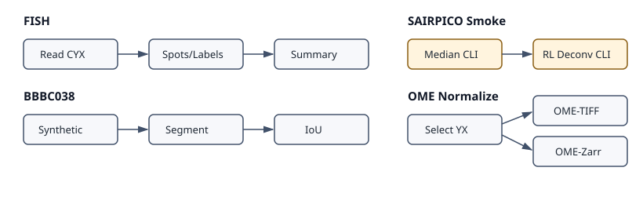

Phase 2 Workflows
=================

Phase 2 adds runnable workflow examples around package-split imports, public
benchmark structure, SAIRPICO command wrappers, and OME output normalization.
The default test path uses tiny synthetic fixtures and avoids public downloads
or heavyweight binaries.

FISH Analysis
-------------

``example-workflows/fish_analysis`` still documents the CIL FISH pipeline with
Atlas spot detection and Cellpose nuclei segmentation. The workflow imports
Cellpose from ``bioimageflow-segmentation-tools`` instead of removed
``bioimageflow_common_tools`` segmentation exports. It still uses common tools
for source, merge, channel extraction, connected components, label-overlap
utilities, and the current Atlas wrapper.

Normal tests construct the full CIL graph, then execute
``build_synthetic_fish_workflow``. The synthetic fallback writes a small CYX
image, extracts marker/nuclei channels, segments nuclei by thresholding, detects
spots with ``bioimageflow-spot-tools``, assigns them to labels, and summarizes
spot counts.

Expected outputs include per-label spot assignment CSV files and a summary table
with ``spot_count`` aggregates.

BBBC038 Segmentation Benchmark
------------------------------

``example-workflows/bbbc038_segmentation_benchmark`` provides a BBBC038-style
nuclei benchmark. The normal workflow creates a 64x64 synthetic image and
reference label mask, segments nuclei with ``ThresholdSegment``, and evaluates
foreground agreement with ``LabelBenchmark``.

For real BBBC038 evaluation, download images and masks from the Broad Bioimage
Benchmark Collection BBBC038 dataset, replace the synthetic image/reference
paths in the builder, and run the same benchmark node. Public-data execution is
kept out of normal tests and should be marked ``slow``.

Expected outputs include predicted/reference label counts, true/false positive
pixel counts, false negative pixel count, and foreground IoU.

SAIRPICO Restoration Smoke
--------------------------

``example-workflows/sairpico_restoration_smoke`` builds a tiny restoration and
deconvolution smoke graph with ``MedianDenoising`` and
``RichardsonLucyDeconvolution`` from ``bioimageflow-sairpico-tools``.

Normal tests monkeypatch ``subprocess.run`` to validate command construction and
write synthetic output files, so SAIRPICO command-line binaries are not required.
Real execution requires the SAIRPICO/simglib environments declared by those
tools.

Expected outputs include the denoised intermediate TIFF and final deconvolved
TIFF.

OME-TIFF / OME-Zarr Normalization
---------------------------------

``example-workflows/ome_normalization`` uses ``bioimageflow-io-tools`` to read a
small CZYX TIFF, select one channel/z-plane, and write both OME-TIFF and
single-scale OME-Zarr outputs.

Expected outputs include ``output_image`` for the OME-TIFF file and
``output_path`` for the OME-Zarr directory containing ``.zgroup``, ``.zattrs``,
and a ``0`` scale array.
