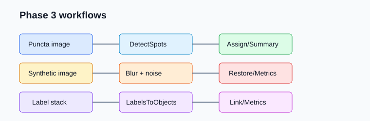

Phase 3 Tool Packages
=====================

Phase 3 adds three lightweight tool packages and matching synthetic workflows.
The default test path avoids public data and heavyweight optional libraries.

Spot Tools
----------

``bioimageflow-spot-tools`` provides:

* ``DetectSpots`` for LoG/DoG/local maxima puncta detection.
* ``AssignSpotsToLabels`` for assigning spot coordinates to label images.
* ``SpotSummary`` for per-label spot count and intensity summaries.

Big-FISH is intentionally optional and reserved for evaluation runs.

Restoration Tools
-----------------

``bioimageflow-restoration-tools`` provides:

* ``RestoreImage`` for a scikit-image restoration baseline, with a NumPy fallback.
* ``BenchmarkRestoration`` for a synthetic blur/noise benchmark that writes metrics.

Tracking Tools
--------------

``bioimageflow-tracking-tools`` provides:

* ``LabelsToObjects`` for object centroid extraction from label images.
* ``LinkObjects`` for lightweight nearest-neighbor linking.
* ``TrackMetrics`` for track length, displacement, speed, and area summaries.

btrack and LapTrack remain optional for heavier evaluation environments.

Example Workflows
-----------------

The synthetic examples live under ``example-workflows``:

* ``phase3_puncta``
* ``phase3_restoration_benchmark``
* ``phase3_tracking``
