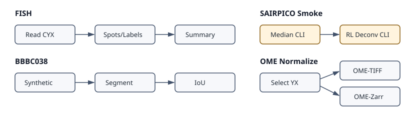

Priority Workflows
==================

These runnable workflow examples cover package-split imports, public benchmark
structure, SAIRPICO command wrappers, and OME output normalization. The default
test path uses tiny synthetic fixtures and avoids public downloads or
heavyweight binaries.

FISH Analysis
-------------

Analysis question
  How many FOLS2 and CSF1R puncta are associated with each nucleus in a
  multi-channel FISH microscopy image?

Data
  Public Cell Image Library FISH images for the full graph, plus a generated
  CYX synthetic fixture for default tests.

``example-workflows/fish_analysis`` still documents the CIL FISH pipeline with
Atlas spot detection and Cellpose nuclei segmentation. The workflow imports
Cellpose from ``bioimageflow-segmentation-tools`` instead of removed
``bioimageflow_common_tools`` segmentation exports. It still uses common tools
for source, merge, channel extraction, connected components, label-overlap
utilities, and the current Atlas wrapper.

Normal tests construct the full CIL graph, then execute
``build_synthetic_fish_workflow``. The synthetic fallback writes a small CYX
image, extracts marker/nuclei channels, segments nuclei by thresholding, detects
spots with ``bioimageflow-spot-tools``, assigns them to labels, and summarizes
spot counts.

Expected outputs include per-label spot assignment dataframe rows and a summary table with ``spot_count`` aggregates.

Test coverage
  Normal tests construct the public-data graph and execute the synthetic
  fallback with generated data and stable count assertions.

BBBC038 Segmentation Benchmark
------------------------------

Analysis question
  Can a segmentation method produce nuclei labels that agree with a known
  reference mask?

Data
  Generated BBBC038-style image/reference masks for default tests, with public
  BBBC038 data reserved for slow validation.

``example-workflows/bbbc038_segmentation_benchmark`` provides a BBBC038-style
nuclei benchmark. The normal workflow creates a 64x64 synthetic image and
reference label mask, segments nuclei with ``ThresholdSegment``, and evaluates
foreground agreement with ``LabelBenchmark``.

For real BBBC038 evaluation, download images and masks from the Broad Bioimage
Benchmark Collection BBBC038 dataset, replace the synthetic image/reference
paths in the builder, and run the same benchmark node. Public-data execution is
kept out of normal tests and should be marked ``slow``.

Expected outputs include predicted/reference label counts, true/false positive
pixel counts, false negative pixel count, and foreground IoU.

Test coverage
  Normal tests execute the generated fixture and assert two predicted labels,
  two reference labels, and foreground IoU above 0.95.

SAIRPICO Restoration Smoke
--------------------------

Analysis question
  Can BioImageFlow orchestrate SAIRPICO restoration commands and pass the
  denoised image into deconvolution reproducibly?

Data
  A generated 2D synthetic image for default tests, with real SAIRPICO binaries
  used only in an external execution environment.

``example-workflows/sairpico_restoration_smoke`` builds a tiny restoration and
deconvolution smoke graph with ``MedianDenoising`` and
``RichardsonLucyDeconvolution`` from ``bioimageflow-sairpico-tools``.

Normal tests monkeypatch ``subprocess.run`` to validate command construction and
write synthetic output files, so SAIRPICO command-line binaries are not required.
Real execution requires the SAIRPICO/simglib environments declared by those
tools.

Expected outputs include the denoised intermediate TIFF and final deconvolved
TIFF.

Test coverage
  Normal tests monkeypatch command execution, assert the generated command
  lines, and assert the expected output files exist. Environment/version
  diagnostics are not workflow tools.

OME-TIFF / OME-Zarr Normalization
---------------------------------

Analysis question
  Can an analyst normalize an input image into exchangeable OME-TIFF and
  OME-Zarr artifacts while selecting the intended plane/channel?

Data
  A generated CZYX TIFF fixture with known pixel values for exact output
  assertions.

``example-workflows/ome_normalization`` uses ``bioimageflow-io-tools`` to read a
small CZYX TIFF, select one channel/z-plane, and convert the selected image to
both OME-TIFF and single-scale OME-Zarr outputs.

Expected outputs include ``output_image`` for the OME-TIFF file and
``output_image_1`` for the OME-Zarr directory containing ``.zgroup``,
``.zattrs``, and a ``0`` scale array.

Test coverage
  Normal tests execute the generated CZYX fixture, verify the selected YX plane
  exactly, and check that both OME conversion outputs are created.
