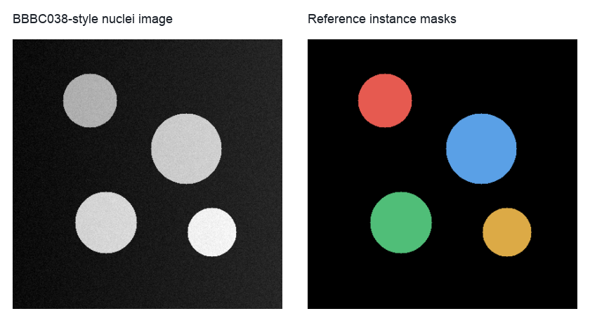
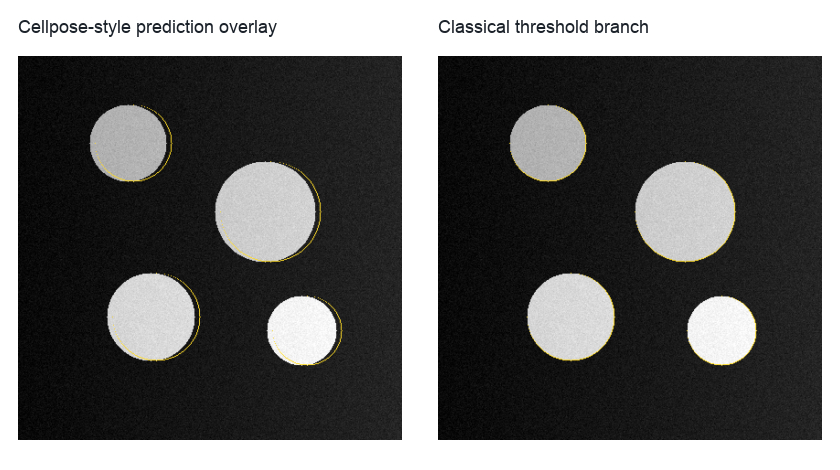

BBBC038 Segmentation Benchmark
==============================

``bbbc038_segmentation_benchmark`` is the public example for comparing segmentation methods against reference instance masks.
It targets the Broad Bioimage Benchmark Collection BBBC038 ``stage1_train`` layout, where each sample folder contains a raw image under ``images/`` and multiple object masks under ``masks/``.

Use this workflow when you want to compare several segmentation branches under the same graph and scoring logic.
The benchmark includes Cellpose v3, Cellpose-SAM, StarDist, and a classical threshold branch, and each method is evaluated against the same reference label image.

   The workflow expects BBBC038 sample folders with raw images and reference instance masks, then builds one reference label image per sample.

Run the workflow with a selected BBBC038 subset:

.. code-block:: bash

   python example_workflows/bbbc038_segmentation_benchmark/workflow.py --data-dir data/bbbc038_stage1_train_subset

For a reviewed benchmark, use named samples from the Broad Bioimage Benchmark Collection rather than arbitrary local microscopy images.
The image above visualizes the folder semantics expected by the workflow; the benchmark itself is designed around the real BBBC038 ``stage1_train`` structure.

Pipeline walkthrough
--------------------

.. raw:: html

   <pre class="mermaid">
   flowchart LR
     samples[BBBC038 stage1_train samples]:::source --> reference[Build reference labels]:::process
     samples --> prepare[Prepare 2D segmentation images]:::process
     prepare --> cp3[Cellpose3]:::method
     prepare --> cpsam[Cellpose-SAM]:::method
     prepare --> stardist[StarDist]:::method
     prepare --> classical[Threshold watershed branch]:::method
     reference --> score[Benchmark each method]:::metric
     cp3 --> score
     cpsam --> score
     stardist --> score
     classical --> score
     score --> table[Method-by-image metrics table]:::metric
     score --> overlays[Prediction overlays]:::artifact
     classDef source fill:#e7f0ff,stroke:#4b73b9,color:#1b2f55
     classDef process fill:#edf8ef,stroke:#4d8f5b,color:#173d20
     classDef method fill:#f3eafd,stroke:#7d57a8,color:#332047
     classDef metric fill:#ffeceb,stroke:#b85b52,color:#4d201c
     classDef artifact fill:#eef6f8,stroke:#4d8794,color:#16343b
   </pre>

The important design point is that each segmentation method is a separate node.
This keeps method-specific parameters, environments, and failures visible, while a shared benchmarking step makes the comparison table consistent.

What you will inspect
---------------------

   Overlays are essential for interpreting benchmark metrics because foreground overlap can hide split and merge errors.

The terminal table contains one row per image and method.
For a reviewed run, inspect the predicted label images, overlays, and foreground agreement metrics together before drawing conclusions about a method.
