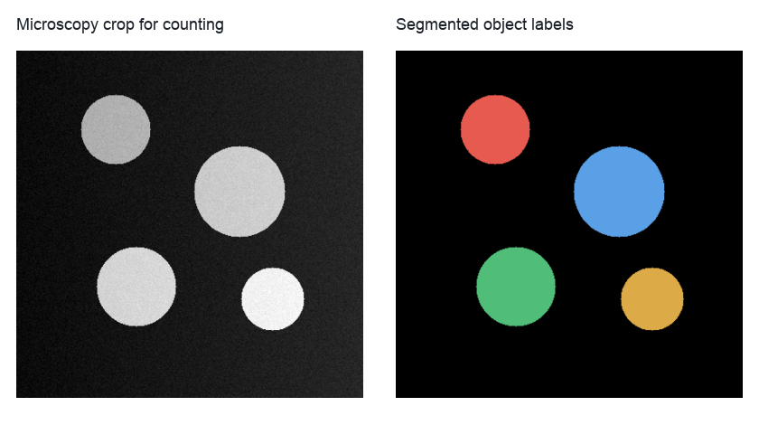
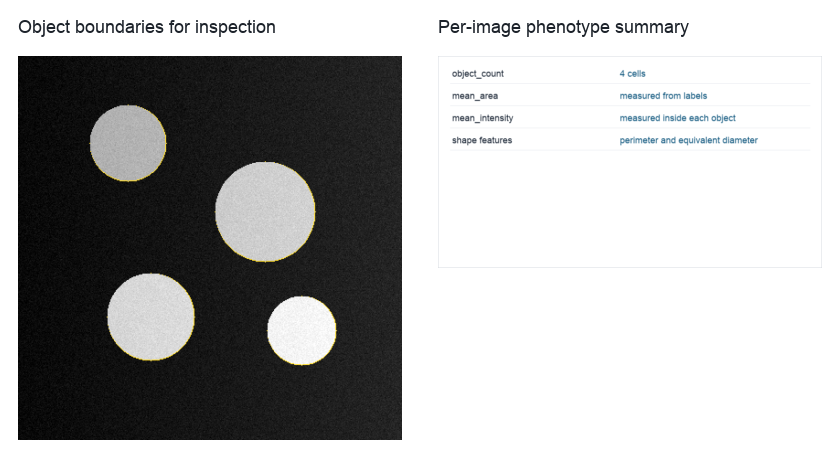

Cell Counting and Phenotyping
=============================

``cell_counting_phenotyping`` is the compact segment-and-measure workflow.
It is intentionally separate from the BBBC038 benchmark: here the purpose is to count cells and summarize object features for an image, not to compare segmentation algorithms.

Use it as a starting point when a single default segmentation method is enough and the downstream question is object measurement.
The workflow segments a supplied 2D microscopy crop, measures region geometry, shape, and intensity, then aggregates per-image phenotype summaries.

   A small nuclei crop is segmented into object labels before measurements are computed.

Run the example with a real crop:

.. code-block:: bash

   python example_workflows/cell_counting_phenotyping/workflow.py --input-image data/bbbc038_crop.tif

A BBBC038 crop is a good source for this workflow because the image content matches the segmentation and measurement assumptions.
If you use a different modality, inspect the labels before interpreting area or intensity summaries.

Pipeline walkthrough
--------------------

.. raw:: html

   <pre class="mermaid">
   flowchart LR
     crop[Microscopy crop]:::source --> segment[Default segmentation]:::process
     segment --> regions[Region properties]:::metric
     segment --> shape[Shape properties]:::metric
     crop --> intensity[Intensity properties]:::metric
     segment --> intensity
     regions --> join[Object feature table]:::process
     shape --> join
     intensity --> join
     join --> summary[Per-image phenotype summary]:::metric
     classDef source fill:#e7f0ff,stroke:#4b73b9,color:#1b2f55
     classDef process fill:#edf8ef,stroke:#4d8f5b,color:#173d20
     classDef metric fill:#ffeceb,stroke:#b85b52,color:#4d201c
   </pre>

The workflow measures the same labels from several perspectives and joins the tables by object label.
That makes it easy to add more feature tools later without changing the overall graph shape.

What you will inspect
---------------------

   Inspect the label boundaries first, then use the summary row for quick comparison across images.

The most useful outputs are the label image, the object feature table, and the per-image phenotype summary.
The summary is convenient for dashboards, but the object table is where you should look when outliers or segmentation mistakes matter.
