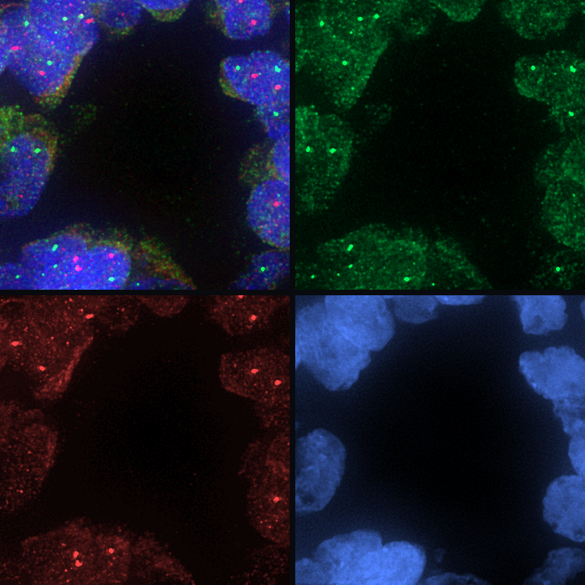
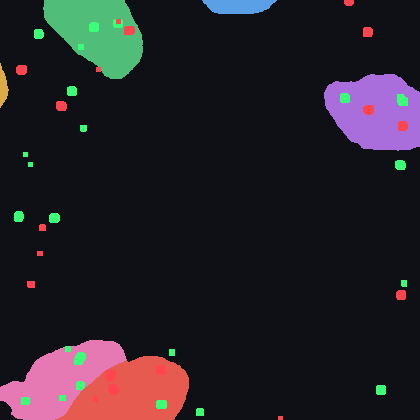

FISH Spot Counting Per Nucleus
==============================

The ``fish_analysis`` workflow analyzes fluorescence in situ hybridization (FISH) images from the Cell Image Library (CIL) to quantify FOLS2 and CSF1R gene-marker spots inside segmented nuclei in breast cancer tissue samples.

The workflow processes three-channel microscopy images: channel 0 contains the green FOLS2 signal, channel 1 contains the red CSF1R signal, and channel 2 contains the blue nuclear stain.
For each image in the batch, the analytical goal is to estimate the average number of FOLS2 and CSF1R spots per nucleus.

The public-data run uses CIL records ``13432``, ``13434``, ``13436``, and ``13438``.
The graph can be inspected without downloading the images; full execution downloads the CIL TIFFs and runs ATLAS-backed spot detection together with Cellpose-backed nuclei segmentation.

   CIL record ``13432`` shown as a merged color crop, followed by the FOLS2 channel, the CSF1R channel, and the nuclei channel.

Run the workflow from the repository root:

.. code-block:: bash

   python example_workflows/fish_analysis/workflow.py

The workflow stores raw CIL downloads under the configured data directory and writes BioImageFlow node outputs under the workflow storage path.
For real runs, the workflow directory records the selected public image records and the expected result files alongside the Python graph.

Workflow Logic
--------------

The pipeline demonstrates a branching topology.
One branch extracts the nuclei channel and segments nuclei once with Cellpose3.
Two parallel marker branches then reuse the same ``MarkerSpotAnalysis`` sub-workflow with different marker names and channel indices before the overlap tables converge in a final statistical aggregation step.

.. raw:: html

   <pre class="mermaid">
   flowchart LR
     cil[Cell Image Library TIFFs]:::source --> nuclei_channel[Extract channel 2]:::process
     nuclei_channel --> cellpose[Cellpose3 nuclei labels]:::seg
     cil --> fols2[MarkerSpotAnalysis: FOLS2, channel 0]:::spot
     cil --> csf1r[MarkerSpotAnalysis: CSF1R, channel 1]:::spot
     cellpose --> fols2
     cellpose --> csf1r
     fols2 --> stats[Average spots per nucleus]:::metric
     csf1r --> stats
     classDef source fill:#e7f0ff,stroke:#4b73b9,color:#1b2f55
     classDef process fill:#edf8ef,stroke:#4d8f5b,color:#173d20
     classDef seg fill:#f3eafd,stroke:#7d57a8,color:#332047
     classDef spot fill:#fff4d6,stroke:#a77a18,color:#4a3200
     classDef metric fill:#ffeceb,stroke:#b85b52,color:#4d201c
   </pre>

1. **Data ingestion and preprocessing:** ``DownloadImages`` creates a table of CIL image paths.
   ``ExtractChannel`` isolates channel 2, producing the nuclear image used by Cellpose3.
2. **Nuclei segmentation:** ``Cellpose3`` segments the nuclear channel and produces a label image in which each nucleus receives a distinct integer identifier.
3. **Spot detection for channels 0 and 1:** The FOLS2 and CSF1R channels are processed independently by two instances of ``MarkerSpotAnalysis``.
   Each instance extracts one marker channel, runs ``AtlasSpotDetection``, converts the detection mask into connected-component spot labels, and measures spot-to-nucleus overlaps.
4. **Spatial correlation:** The marker branches converge through ``LabelOverlaps`` inside ``MarkerSpotAnalysis``.
   These nodes output tables describing which spot labels overlap which nuclear labels rather than producing another image.
5. **Statistical aggregation:** ``AverageSpotsPerNucleus`` filters background labels, groups spots by parent nucleus, and reports per-image averages and marker-specific totals.

MarkerSpotAnalysis Sub-Workflow
-------------------------------

``MarkerSpotAnalysis`` is the reusable branch that keeps the FOLS2 and CSF1R logic identical.
Only ``marker_name`` and ``channel`` change between the two instances in the parent graph.

.. raw:: html

   <pre class="mermaid">
   flowchart LR
     image[Multi-channel FISH image]:::source --> extract[Extract marker channel]:::process
     extract --> atlas[AtlasSpotDetection]:::spot
     atlas --> cc[ConnectedComponents spot labels]:::spot
     nuclei[Cellpose nuclei labels]:::seg --> overlaps[LabelOverlaps]:::metric
     cc --> overlaps
     overlaps --> table[Overlap table]:::metric
     classDef source fill:#e7f0ff,stroke:#4b73b9,color:#1b2f55
     classDef process fill:#edf8ef,stroke:#4d8f5b,color:#173d20
     classDef seg fill:#f3eafd,stroke:#7d57a8,color:#332047
     classDef spot fill:#fff4d6,stroke:#a77a18,color:#4a3200
     classDef metric fill:#ffeceb,stroke:#b85b52,color:#4d201c
   </pre>

What you will inspect
---------------------

   Output preview for the same CIL ``13432`` crop.
   Cellpose nuclei are shown as color-coded labels; FOLS2 detections are overlaid in green and CSF1R detections are overlaid in red.

The terminal table contains one row per image with average FOLS2 and CSF1R spot counts per nucleus, the number of observed nuclei, the number of marker-positive nuclei, and marker-specific spot totals.
When adapting the workflow, inspect the nuclei labels, marker detection masks, overlap tables, and overlay preview together; a high marker count is meaningful only when the segmentation and spot detection are plausible in the image.
