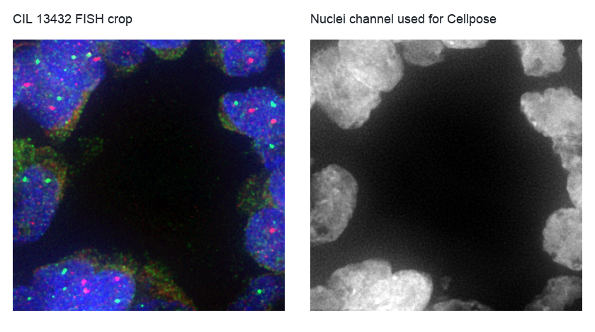
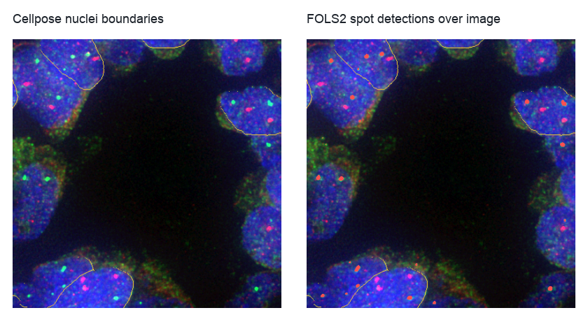

FISH Spot Counting Per Nucleus
==============================

``fish_analysis`` is the canonical BioImageFlow sub-workflow example.
It uses four Cell Image Library fluorescence in situ hybridization images, segments nuclei once, then runs the same marker-analysis branch for the FOLS2 and CSF1R channels.
The useful lesson is not only the biology-specific output; it is the workflow pattern of reusing one marker-analysis sub-workflow with different marker names and channel indices.

The images used for the public-data run are Cell Image Library records ``13432``, ``13434``, ``13436``, and ``13438``.
Each image has a green FOLS2 channel, a red CSF1R channel, and a blue nuclei channel.
You can inspect and export the graph without downloading the images; executing the full workflow downloads the CIL TIFFs and exercises ATLAS and Cellpose-backed processing.

   A crop from CIL record 13432 illustrates the multichannel input and the nuclei channel that feeds Cellpose v3.

Run the workflow from the repository root:

.. code-block:: bash

   python example-workflows/fish_analysis/workflow.py

The workflow stores raw CIL downloads under the configured data directory and writes BioImageFlow node outputs under the workflow storage path.
For real runs, the workflow directory records the selected public image records and the expected result files alongside the Python graph.

Pipeline walkthrough
--------------------

.. raw:: html

   <pre class="mermaid">
   flowchart LR
     cil[Cell Image Library TIFFs]:::source --> nuclei[Extract nuclei channel]:::process
     nuclei --> cellpose[Cellpose3 nuclei labels]:::seg
     cil --> fols2[MarkerSpotAnalysis: FOLS2]:::spot
     cil --> csf1r[MarkerSpotAnalysis: CSF1R]:::spot
     cellpose --> fols2
     cellpose --> csf1r
     fols2 --> summary[Per-nucleus and per-image summaries]:::metric
     csf1r --> summary
     classDef source fill:#e7f0ff,stroke:#4b73b9,color:#1b2f55
     classDef process fill:#edf8ef,stroke:#4d8f5b,color:#173d20
     classDef seg fill:#f3eafd,stroke:#7d57a8,color:#332047
     classDef spot fill:#fff4d6,stroke:#a77a18,color:#4a3200
     classDef metric fill:#ffeceb,stroke:#b85b52,color:#4d201c
   </pre>

``MarkerSpotAnalysis`` extracts one marker channel, runs ``AtlasSpotDetection``, labels connected spot masks, and measures spot-to-nucleus overlaps.
Because the branch is parameterized by marker name and channel index, the FOLS2 and CSF1R analyses stay visibly parallel in the graph instead of becoming two copy-pasted workflows.

What you will inspect
---------------------

   Nuclei boundaries and marker detections are the first artifacts to inspect before trusting spot-per-nucleus summaries.

The terminal table reports one row per image with average marker spots per nucleus and marker-specific totals.
When adapting the workflow, inspect the nuclei labels, marker spot masks, overlap tables, and overlay previews together; a high marker count is only meaningful if segmentation and spot detection are plausible in the image.
