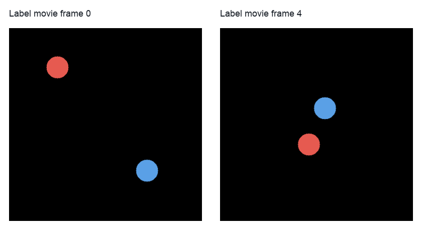
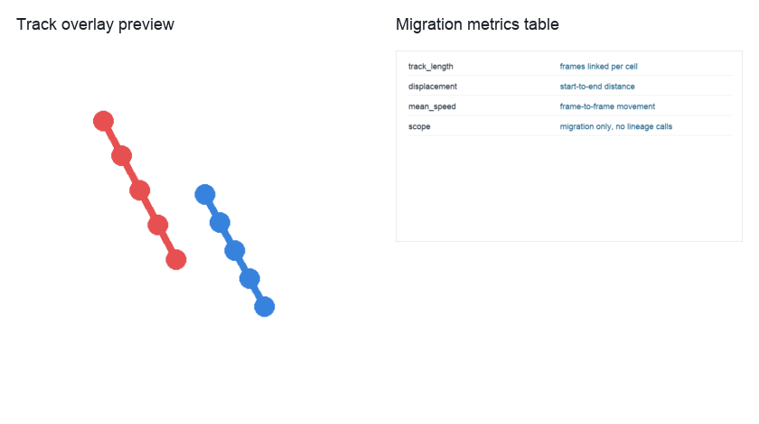

Live-Cell Migration Tracking
============================

``live_cell_tracking`` compares migration tracks from Ultrack and btrack adapters on a short 2D label movie.
The workflow is scoped to migration metrics: it does not perform lineage or division analysis.

Use this tutorial when you already have segmentation labels over time and want to evaluate track continuity, displacement, and speed.
For a real example, use selected frames from a 2D Cell Tracking Challenge dataset or another TYX label movie with comparable object density.

   The workflow starts from labels over time, not raw movie frames.

Run the workflow with a label stack:

.. code-block:: bash

   python example-workflows/live_cell_tracking/workflow.py --label-image data/ctc_label_movie.tif

Prepare a TYX label image where each frame contains integer object labels.
If you start from raw fluorescence frames, add a segmentation workflow before this tracking workflow rather than making the tracking adapter infer detections implicitly.

Pipeline walkthrough
--------------------

.. raw:: html

   <pre class="mermaid">
   flowchart LR
     labels[TYX label movie]:::source --> objects[Labels to tracking objects]:::process
     objects --> ultrack[Ultrack adapter]:::tracker
     objects --> btrack[btrack adapter]:::tracker
     ultrack --> ulmetrics[Ultrack migration metrics]:::metric
     btrack --> btmetrics[btrack migration metrics]:::metric
     ulmetrics --> table[Combined migration metrics]:::metric
     btmetrics --> table
     classDef source fill:#e7f0ff,stroke:#4b73b9,color:#1b2f55
     classDef process fill:#edf8ef,stroke:#4d8f5b,color:#173d20
     classDef tracker fill:#f3eafd,stroke:#7d57a8,color:#332047
     classDef metric fill:#ffeceb,stroke:#b85b52,color:#4d201c
   </pre>

The adapters keep library-specific tracking behind explicit nodes.
That makes it possible to compare tracker outputs while keeping the downstream migration metrics consistent.

What you will inspect
---------------------

   Track overlays show whether object identities remain continuous; the table summarizes motion after those identities are assigned.

Inspect the track table before interpreting speed or displacement.
A single identity swap can create plausible-looking aggregate metrics while corrupting the movement history for individual cells.
