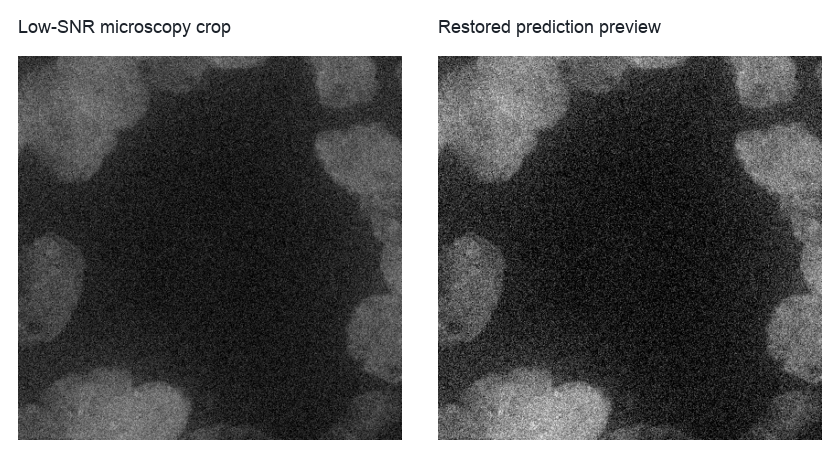
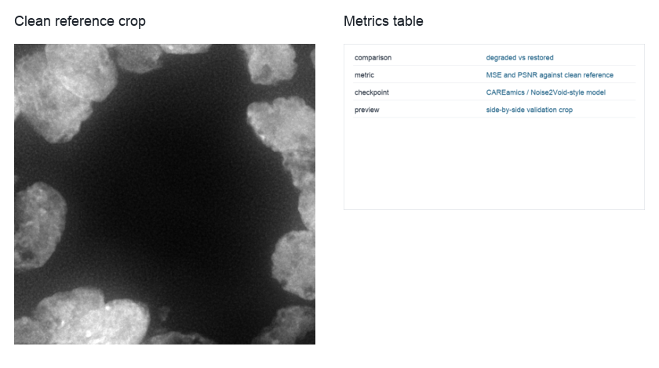

Low-SNR Restoration
===================

``low_snr_restoration`` demonstrates how BioImageFlow wires a restoration model into a reproducible evaluation workflow.
The workflow expects a degraded microscopy crop, a clean or higher-SNR reference crop, and a CAREamics-compatible checkpoint.

Use this workflow when you want to evaluate inference on held-out crops, not train a model inside the example.
Real checkpoints and restoration datasets are project-specific, so the workflow accepts them as paths at runtime instead of bundling model files.

   The documentation preview shows the before-and-after view users should inspect; an executed workflow writes the restored image produced by the configured CAREamics checkpoint.

Run the workflow with supplied images and a checkpoint:

.. code-block:: bash

   python example-workflows/low_snr_restoration/workflow.py --clean-image data/low_snr_clean_crop.tif --degraded-image data/low_snr_degraded_crop.tif --checkpoint models/careamics.ckpt

Keep the clean and degraded crops registered and cropped to the same field of view.
The metrics only make sense when every pixel in the clean reference corresponds to the same specimen location in the degraded image.

Pipeline walkthrough
--------------------

.. raw:: html

   <pre class="mermaid">
   flowchart LR
     degraded[Low-SNR crop]:::source --> careamics[CAREamics prediction]:::process
     checkpoint[Restoration checkpoint]:::model --> careamics
     clean[Clean reference crop]:::source --> metrics[Restoration metrics]:::metric
     degraded --> metrics
     careamics --> metrics
     degraded --> preview[Comparison preview]:::artifact
     careamics --> preview
     clean --> preview
     metrics --> results[Restoration results table]:::metric
     preview --> results
     classDef source fill:#e7f0ff,stroke:#4b73b9,color:#1b2f55
     classDef model fill:#fff4d6,stroke:#a77a18,color:#4a3200
     classDef process fill:#edf8ef,stroke:#4d8f5b,color:#173d20
     classDef metric fill:#ffeceb,stroke:#b85b52,color:#4d201c
     classDef artifact fill:#eef6f8,stroke:#4d8794,color:#16343b
   </pre>

The restoration node is deliberately model-facing.
The public workflow does not expose a baseline backend; it expects a real checkpoint path and writes the model prediction as a normal BioImageFlow artifact.

What you will inspect
---------------------

   The visual preview and metric table should be read together; a better metric alone does not guarantee a useful biological image.

The terminal table reports degraded-versus-restored error and PSNR-style metrics, and the preview image lets you check whether the model introduced artifacts.
For real microscopy work, also inspect structures that matter biologically, such as nuclei boundaries, puncta, or membranes, rather than only global pixel metrics.
