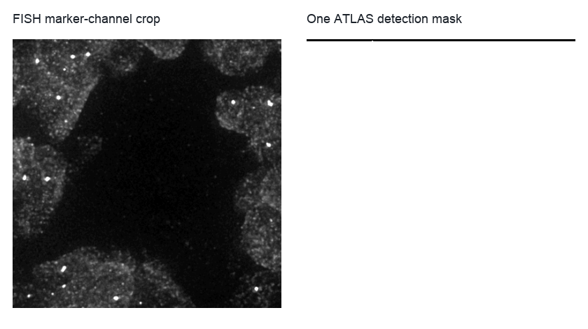
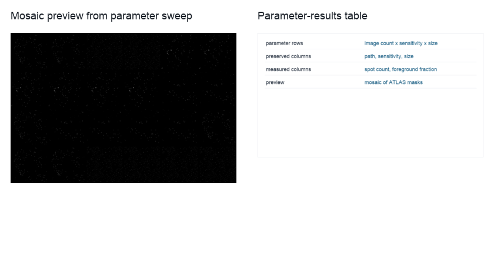

ATLAS Parameter Space Exploration
=================================

``parameter_space_exploration`` helps choose ATLAS spot-detection settings before those settings are used in a marker workflow such as FISH analysis.
It takes FISH marker-channel images, builds a small grid of ATLAS sensitivity and spot-size settings, runs every image-parameter combination, then returns a table and mosaic for review.

Use this tutorial when you have a marker channel where spots are real biological signal but the right p-value or scale is not obvious.
The documented public-data path starts from a Cell Image Library FISH image, extracts a marker channel crop, and sweeps parameters on that crop.

   The workflow works on marker-channel crops, not generated dot images.

Run the example on a directory of marker-channel TIFFs:

.. code-block:: bash

   python example_workflows/parameter_space_exploration/workflow.py ./data ./parameter_space_results

For a real FISH tuning session, prepare one or more marker-channel crops and keep the image naming meaningful.
The workflow preserves the image path and parameter columns so that the final rows can be traced back to both the source crop and the ATLAS settings.

Pipeline walkthrough
--------------------

.. raw:: html

   <pre class="mermaid">
   flowchart LR
     images[FISH marker-channel images]:::source --> grid[CrossJoin images with ATLAS settings]:::process
     sensitivity[Sensitivity values]:::param --> grid
     size[Spot-size values]:::param --> grid
     grid --> atlas[AtlasSpotDetection]:::spot
     atlas --> metrics[Spot-mask metrics]:::metric
     atlas --> mosaic[Mosaic preview]:::artifact
     metrics --> results[Parameter-results table]:::metric
     mosaic --> results
     classDef source fill:#e7f0ff,stroke:#4b73b9,color:#1b2f55
     classDef param fill:#fff4d6,stroke:#a77a18,color:#4a3200
     classDef process fill:#edf8ef,stroke:#4d8f5b,color:#173d20
     classDef spot fill:#f3eafd,stroke:#7d57a8,color:#332047
     classDef metric fill:#ffeceb,stroke:#b85b52,color:#4d201c
     classDef artifact fill:#eef6f8,stroke:#4d8794,color:#16343b
   </pre>

The key BioImageFlow pattern is the ``CrossJoin`` node.
It turns a list of images and a list of parameter values into a table of concrete ATLAS runs, then every downstream row keeps the parameter context attached.

What you will inspect
---------------------

   The mosaic shows whether detections are visually plausible, while the table makes count and foreground-area shifts easy to compare.

Do not choose parameters from spot count alone.
Use the mosaic to catch settings that merge nearby spots, create broad foreground regions, or miss dim but credible signal.
