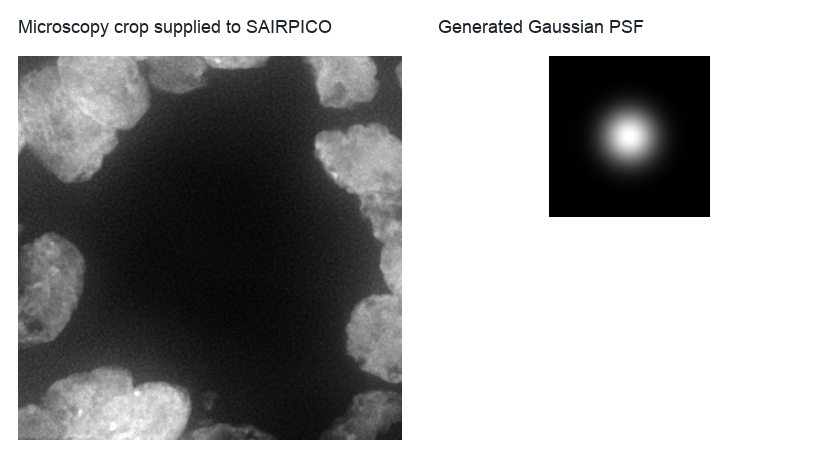
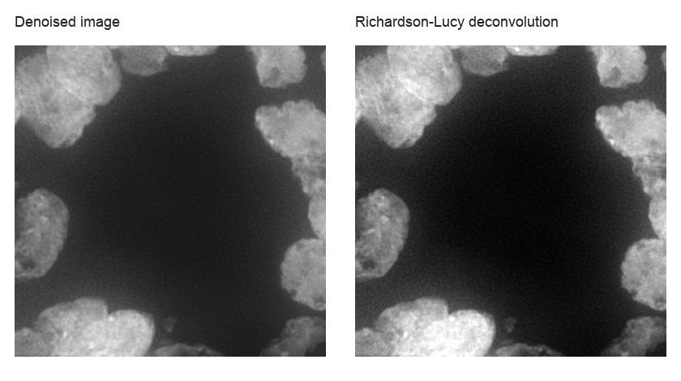

SAIRPICO Deconvolution
======================

``sairpico_deconvolution`` shows how BioImageFlow wraps SAIRPICO command-line tools in a microscopy restoration workflow.
It starts from a supplied microscopy crop, generates a point-spread function, runs denoising, feeds the generated PSF into Richardson-Lucy deconvolution, and records image-quality metrics.

Use this workflow when you want a reproducible deconvolution pipeline whose external command calls are visible in the graph.
Install the real SAIRPICO binaries before executing the command; the workflow graph keeps every generated image and command output explicit.

   The generated PSF is an explicit workflow artifact, not an implicit parameter hidden inside the deconvolution call.

Run the workflow with a supplied crop:

.. code-block:: bash

   python example-workflows/sairpico_deconvolution/workflow.py --input-image data/13432_fish_crop.tif

FISH CIL crops are convenient lightweight inputs for this tutorial.
For a production deconvolution run, use a crop and PSF model that match the microscope and acquisition settings.

Pipeline walkthrough
--------------------

.. raw:: html

   <pre class="mermaid">
   flowchart LR
     image[Microscopy crop]:::source --> denoise[SAIRPICO median denoising]:::process
     image --> psf[Generate PSF]:::process
     denoise --> join[Pair denoised image with PSF]:::process
     psf --> join
     join --> rl[Richardson-Lucy deconvolution]:::process
     image --> metrics[Sharpness and residual-noise metrics]:::metric
     denoise --> metrics
     rl --> metrics
     classDef source fill:#e7f0ff,stroke:#4b73b9,color:#1b2f55
     classDef process fill:#edf8ef,stroke:#4d8f5b,color:#173d20
     classDef metric fill:#ffeceb,stroke:#b85b52,color:#4d201c
   </pre>

The explicit merge node matters because deconvolution consumes two upstream products: the denoised image and the generated PSF.
That makes the dependency visible in exported workflow graphs and in cached results.

What you will inspect
---------------------

   The documentation preview illustrates the pair of image artifacts to inspect after execution: the SAIRPICO denoised image and the Richardson-Lucy deconvolution result.

The metrics table is a compact numerical summary, but the images are the primary review artifact.
If deconvolution creates ringing, amplifies background structure, or sharpens noise, change the PSF and iteration settings before trusting the output.
